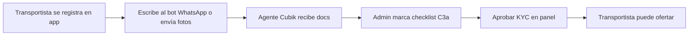

# C3a — Checklist transportista (piloto manual)

**Alcance:** proceso operativo WhatsApp + panel admin · **SQL:** [`RUN_033_carrier_onboarding.sql`](./RUN_033_carrier_onboarding.sql)

---

## Flujo resumido

---

## 1. Transportista (WhatsApp)

1. Registrarse en https://www.getcubik.cl/app (rol **transportista**).
2. Abrir WhatsApp Cubik (botón landing o bot).
3. Escribir **documentos** o opción **6** del menú.
4. Enviar fotos **legibles**:
   - Cédula anverso/reverso
   - Licencia vigente
   - SOAP
   - Póliza RC / carga (según rubro)
5. En un mensaje de texto indicar:
   - **Email** de la app (obligatorio para cruzar cuenta)
   - **Rubro** (construcción / retail-alimentos / frío / general)
   - **Tipo de camión** (tolva, semi, furgón, thermo…)
   - **Patente(s)**

---

## 2. Admin Cubik (panel)

1. Entrar como `admin@getcubik.cl` → **Cuenta** → **Cuentas KYC**.
2. Buscar transportista pendiente (mismo email).
3. Completar **Checklist C3a**:
   - ☑ CI · ☑ Licencia · ☑ SOAP · ☑ Seguro
   - Rubro + nivel A/B/C + patentes
   - Notas (link Drive, observaciones)
4. **Guardar checklist**.
5. **Aprobar** (bloqueado si falta ítem — confirmar forzado solo excepciones).

### Niveles de seguro (referencia)

| Nivel | Revisión mínima |
|-------|-----------------|
| **A** | SOAP + RC vehículo |
| **B** | + póliza carga acorde al rubro |
| **C** | Curaduría explícita (químicos, etc.) |

Detalle: [ONBOARDING-PILOTO-RUBROS.md](./ONBOARDING-PILOTO-RUBROS.md) §1.2.

---

## 3. API (referencia)

| Método | Ruta | Uso |
|--------|------|-----|
| `GET` | `/api/admin/users?status=pending` | Lista + progreso checklist |
| `PATCH` | `/api/admin/users/:id/onboarding` | Guardar checklist |
| `PATCH` | `/api/admin/users/:id/kyc` | Aprobar/rechazar (`force: true` si incompleto) |

---

## 4. Checklist operación (imprimir)

- [ ] Cédula identidad
- [ ] Licencia vigente
- [ ] SOAP al día
- [ ] Seguro RC/carga (nivel A/B/C)
- [ ] Rubro + tipo flota declarados
- [ ] Patente(s) registradas
- [ ] Cuenta bancaria en app (antes de primer viaje)
- [ ] APK instalada + GPS «siempre»

---

## 5. Referencias

- Estrategia rubros: [ONBOARDING-PILOTO-RUBROS.md](./ONBOARDING-PILOTO-RUBROS.md)
- Bot WhatsApp: [WHATSAPP-META-CLOUD.md](./WHATSAPP-META-CLOUD.md)
- SQL KYC: [SQL-SUPABASE.md](./SQL-SUPABASE.md)

**Actualizado:** 16 jun 2026
