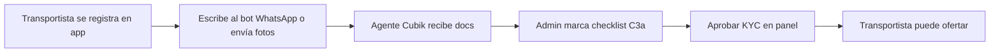

# C3a — Checklist transportista (piloto manual)

**Alcance:** proceso operativo WhatsApp + panel admin · **SQL:** [`RUN_033_carrier_onboarding.sql`](./RUN_033_carrier_onboarding.sql)

---

## Flujo resumido

---

## 1. Transportista (WhatsApp)

1. Registrarse en https://www.getcubik.cl/app (rol **transportista**).
2. Abrir WhatsApp Cubik (botón landing o bot).
3. Escribir **documentos** o opción **6** del menú.
4. Indicar **RUT**, **email de la app** o **nombre completo** — el bot valida si la cuenta existe, está pendiente o aprobada.
5. Según estado:
   - **Pendiente:** enviar checklist (fotos legibles).
   - **Aprobada:** consultar vencimientos registrados o actualizar CI / licencia / seguro / SOAP.
   - **Vencida:** cuenta bloqueada en app — solo actualizar docs por WhatsApp.
6. Enviar fotos **legibles** (el bot confirma recepción; **no** valida OCR ni rostro automático — revisión admin):
   - Cédula anverso/reverso
   - Licencia vigente
   - SOAP
   - Póliza RC / carga (según rubro)
5. En un mensaje de texto indicar:
   - **Email** de la app (obligatorio para cruzar cuenta)
   - **Rubro** (construcción / retail-alimentos / frío / general)
   - **Tipo de camión** (tolva, semi, furgón, thermo…)
   - **Patente(s)**

---

## 2. Admin Cubik (panel)

1. Entrar como `admin@getcubik.cl` → **Cuenta** → **Cuentas KYC**.
2. Buscar transportista pendiente (mismo email).
3. Completar **Checklist C3a**:
   - ☑ CI · ☑ Licencia · ☑ SOAP · ☑ Seguro
   - Rubro + nivel A/B/C + patentes
   - Notas (link Drive, observaciones)
4. **Guardar checklist**.
5. **Aprobar** (bloqueado si falta ítem — confirmar forzado solo excepciones).

> **Nota:** cuentas aprobadas antes de C3a pueden mostrar checklist 0/7. Volver a *pendiente*, completar checklist y re-aprobar.

### Niveles de seguro (referencia)

| Nivel | Revisión mínima |
|-------|-----------------|
| **A** | SOAP + RC vehículo |
| **B** | + póliza carga acorde al rubro |
| **C** | Curaduría explícita (químicos, etc.) |

Detalle: [ONBOARDING-PILOTO-RUBROS.md](./ONBOARDING-PILOTO-RUBROS.md) §1.2.

> **Roadmap O2:** el transportista subirá la **póliza en la app** (foto/PDF); OCR + reglas sugerirán nivel A/B/C. En piloto C3a el admin sigue eligiendo nivel manualmente tras revisar el documento por WhatsApp.

---

## 2b. Tour en app (transportista pendiente)

Tras registrarse, el transportista ve un **tour de 4 pasos** en la app (banner KYC / pestaña Cuenta):

| Paso | Herramienta | Qué hacer |
|------|-------------|-----------|
| 1. Cuenta | App | Registro completado |
| 2. Documentación | **WhatsApp Cubik** | CI, licencia, SOAP, seguro + rubro/patente |
| 3. Revisión | Equipo Cubik | Admin marca checklist C3a |
| 4. Operar | App | Tras `kyc_status = approved` |

Estados expuestos en `GET /api/auth/me`: `kyc_phase` (`docs_pending` | `admin_review` | `docs_expired`) y `onboarding_progress` (0–7).

### Vencimiento documentos (034)

Admin registra **RUT titular** y fechas de vencimiento (CI, licencia, seguro, SOAP) al marcar checklist.

| Estado | App | WhatsApp |
|--------|-----|----------|
| **expiring** (≤30 días) | Notificación *Importante* en campana | Opcional renovar |
| **expired** | Cuenta bloqueada — solo banner + WhatsApp | Actualizar documento vencido |

SQL: [`RUN_034_carrier_document_expiry.sql`](./RUN_034_carrier_document_expiry.sql)

---

## 3. API (referencia)

| Método | Ruta | Uso |
|--------|------|-----|
| `GET` | `/api/admin/users?status=pending` | Lista + progreso checklist |
| `PATCH` | `/api/admin/users/:id/onboarding` | Guardar checklist |
| `PATCH` | `/api/admin/users/:id/kyc` | Aprobar/rechazar (`force: true` si incompleto) |

---

## 4. Checklist operación (imprimir)

- [ ] Cédula identidad
- [ ] Licencia vigente
- [ ] SOAP al día
- [ ] Seguro RC/carga (nivel A/B/C)
- [ ] Rubro + tipo flota declarados
- [ ] Patente(s) registradas
- [ ] Cuenta bancaria en app (antes de primer viaje)
- [ ] APK instalada + GPS «siempre»

---

## 6. Verificación automática (roadmap O1–O2)

C3a es **piloto manual**. Producto objetivo:

| Ítem | Objetivo | Proveedores a evaluar (Chile/LATAM) |
|------|----------|-------------------------------------|
| **CI + rostro** (O1) | Match persona ↔ cédula, anti-suplantación | **BCI Mach** (banca), **Onfido**, **Verifik**, **Truora** |
| **Licencia** (O1/O2) | OCR clase/vigencia + match con datos registrados + selfie | Mismo SDK KYC + OCR (Textract / Document AI) |
| **Póliza seguro** (O2) | Upload en app → clasificar A/B/C por cobertura/rubro | OCR + reglas internas; revisión admin en casos C |

No hay API pública del Registro Civil para licencias; la validación legal fuerte pasa por proveedor KYC certificado o curaduría manual.

---

## 5. Referencias

- Estrategia rubros: [ONBOARDING-PILOTO-RUBROS.md](./ONBOARDING-PILOTO-RUBROS.md)
- Bot WhatsApp: [WHATSAPP-META-CLOUD.md](./WHATSAPP-META-CLOUD.md)
- SQL KYC: [SQL-SUPABASE.md](./SQL-SUPABASE.md)

**Actualizado:** 16 jun 2026
